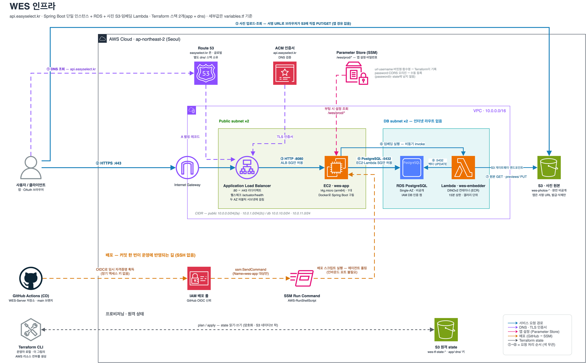

# WES Infrastructure

OAuth 로그인과 사진 갤러리(업로드·AI 분석) 테스트용 AWS 인프라를 Terraform으로 관리한다. 단일 EC2, Single-AZ RDS, 사진 원본 S3 버킷, AI Lambda 셋(embedder · score · categorize)으로 구성한 폐기 가능한 테스트 환경이며, 운영용 고가용성·백업·삭제 보호는 구성하지 않는다.

---

## # 아키텍처

현재 Terraform 기본값 기준. 서비스 요청 경로와 배포·설정·state 흐름을 색으로 구분해 표시한다.



편집 원본 : [`docs/wes-infrastructure-architecture.drawio`](docs/wes-infrastructure-architecture.drawio)

---

## # 주요 구성

DNS와 앱 스택을 분리해 앱 스택을 삭제해도 Hosted Zone과 NS 위임을 유지한다.

- 요청 경로 : `api.easyselect.kr` → ALB(HTTPS) → EC2 `:8080` → RDS PostgreSQL `:5432`
- 백오피스 경로 : 허용된 Tailscale 최고 관리자 → `admin.easyselect.kr` → 전용 EC2의 tailnet TCP `:443` → localhost Caddy/BackOffice. BackOffice는 같은 호스트의 `wes-admin-api`와 외부 라우팅 없는 Docker network로만 통신한다
- 사진 경로 : 브라우저가 서명 URL로 S3(`wes-photos-*`)에 직접 PUT/GET → 사진 바이트가 앱을 거치지 않는다
- AI 분석 : 앱이 갤러리 단위로 Lambda 셋을 단계마다 비동기 호출한다. `wes-embedder`가 S3 게이트웨이 엔드포인트로 원본을 읽어 미리보기와 DINOv3 임베딩을 남기고, `wes-score`가 미리보기마다 CLIP·ARNIQA·LAION 점수를 매긴 뒤 `wes-categorize`를 체인 호출하고, categorize가 그룹을 묶어 Bedrock(`global.` Sonnet 프로필)으로 이름을 짓는다. 코드는 AI 저장소(`organic-agent-ai`)의 최상위 디렉토리 하나 = 함수 하나
- 모니터링 : 앱이 logback appender로 모니터링 EC2(`wes-monitoring`, t4g.micro + EIP)의 Loki `:3100`에 로그를 보내고, `monitoring.easyselect.kr` → Caddy(Let's Encrypt) → Grafana로 조회한다. ALB를 거치지 않는다
- 네트워크 : 2개 AZ의 public/DB subnet. DB subnet은 인터넷 경로가 없고 S3 게이트웨이 엔드포인트와 `lambda`·`bedrock-runtime` 인터페이스 엔드포인트(Lambda 재호출·체인·Bedrock 호출용, 시간당 과금)만 연결된다
- 설정 : 공개 API는 `/wes/prod/*`, 관리자 API는 `/wes/admin-api/prod/*`를 읽는다. Grafana 비밀번호는 `/wes/monitoring/*`에 분리한다. DB 비밀번호는 Terraform state에 넣지 않고 각 경로의 수동 SecureString으로 관리한다
- 보안 : ALB `:80/:443` → 공개 API EC2 `:8080`(ALB SG만), RDS `:5432`는 공개 API·관리자 API·Lambda SG(셋이 공유)만 허용한다. 관리자 API `:8081`은 SG/Caddy에 열지 않고 localhost health와 Docker internal network에서만 사용한다
- 배포 : 서버 저장소는 공개 API·관리자 API에 서로 다른 최소권한 OIDC 역할을 사용하고, AI 저장소는 Lambda 셋의 ECR push·코드 갱신만 되는 worker 역할을 쓴다. BackOffice도 전용 역할을 쓰며, 같은 관리자 호스트의 두 CD는 공통 `flock`으로 직렬화한다
- State : app/dns 스택이 관리하지 않는 사전 생성 S3 backend에서 `app/terraform.tfstate`, `dns/terraform.tfstate` 키를 분리하고 S3 native lock을 사용한다

---

## # 확인 명령

인프라 변경 전 포맷·정적 검증·비파괴 계획을 확인한다.

```sh
terraform fmt -check -recursive
terraform validate
terraform plan
```

PR을 열면 CI가 같은 검사와 `plan`을 돌려 요약을 댓글로 달고, `main`에 머지되면 CD가 `apply`한다. 최초 배포와 CI 롤(`modules/github-actions`) 변경만 로컬 `apply`가 필요하다. `destroy`는 항상 수동이다.

---

## # 문서

배포·운영 절차와 Terraform 학습 내용은 별도 문서에서 관리한다.

- [배포 순서](docs/deploy-order.md)
- [운영 런북](docs/runbook.md)
- [백오피스 Tailscale 내부 접근](docs/admin-internal-access.md)
- [Terraform 학습 가이드](wes-terraform-learning-guide.md)
