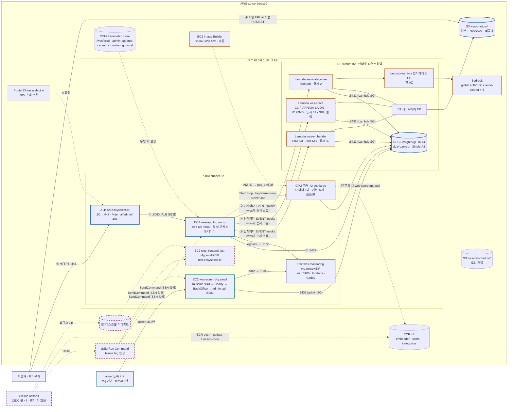

# WES 인프라 구성 (2026-09-09 · main 42b33c6 기준)

`variables.tf` 기본값과 모듈 코드 기준의 현재 구성. 그림 원본은 claude.ai 아티팩트(README 링크)이고, 이 문서는 GitHub에서 바로 읽히도록 Mermaid로 요약한다. `docs/architecture/wes-infrastructure-architecture.drawio/.png`도 같은 기준으로 갱신했고(#65), 아래 "기존 그림과의 차이"는 그 전 그림(2026-09-05)에서 무엇이 바뀌었는지의 기록이다.

## 전체 구성

## 요청·데이터 경로

- **공개 API**: `api.easyselect.kr` → ALB(:80→:443, ACM) → wes-app `:8080`(ALB SG만) → RDS `:5432`(EC2 SG). ALB 리스너 규칙이 `/internal/admin*`을 404로 고정한다.
- **사진**: 앱이 서명 URL을 발급하고 브라우저가 S3에 직접 PUT/GET 한다. 버킷 CORS는 공개 오리진(SSM `cors.allowed-origins`)에 admin 오리진을 합친 한 목록이다.
- **관리자**: `admin.easyselect.kr` → Tailscale IP. grant는 member + tagged 노드에 `tag:wes-admin tcp:443`만. 호스트 안은 Tailscale Serve :443 → Caddy :8443(Let's Encrypt, Route 53 DNS-01) → BackOffice BFF → wes-admin-api :8081(Flyway OFF, 전용 DB 계정). SG 인바운드 0, Docker 네트워크 2개로 격리.
- **AI 분석 v2**: wes 스위퍼가 photoIds 배치를 EVENT로 보내고 각 단계는 RDS에 쓰고 끝난다. Lambda 간 호출·자기 재호출은 폐지(#57, lambda 인터페이스 엔드포인트 제거). score는 `app.analysis.gpu.enabled=true`면 GPU 워커, Lambda는 폴백. Lambda 자체 재시도 0 · 이벤트 age 20분 · AsyncEventAge/Dropped 알람.
- **GPU 워커 풀**: g6.xlarge 두 대(AZ마다 1대), 생성 직후 정지. Start/Stop 주체는 ① wes GpuController(태그 `Name=wes-score-gpu`) ② 워커 유휴 30초 자기 정지 ③ wes 무진행 안전망 ④ CloudWatch 30분 CPU<5% 정지 알람(최후). AMI는 Image Builder 수동 빌드 → `gpu_ami_id` PR. 코드 이미지는 부팅 때 ECR `wes-score:gpu` pull. 정지 인스턴스의 `associate_public_ip_address` 드리프트는 ignore_changes(#57).
- **모니터링**: wes-monitoring(Loki 3.5.3 · Grafana 12.1.1 · Caddy)에 앱·관리자 API가 사설 IP `:3100`으로 push, `monitoring.easyselect.kr` → EIP 직결(ALB 아님). 보존 168h. Grafana 비밀번호는 `/wes/monitoring/*`.
- **테스트 프론트**: wes-frontend-test → `test.easyselect.kr`, Caddy 정적. test-web 저장소 OIDC 롤이 릴리스 zip을 전용 S3에 올리고 고정 SSM 문서만 실행. StatusCheckFailed 알람.
- **배포·state**: OIDC 롤 7개(server · admin-api · backoffice · ai-worker · test-web · tf_plan · tf_apply). PR에서 plan, main 머지에서 apply. bootstrap과 `modules/github-actions` 변경만 로컬 apply. state는 사전 생성 S3 `app/`·`dns/` 키 + native lock. DB 비밀번호는 수동 SecureString.

## 인벤토리

| 이름 | 타입 | 위치 | 인바운드 | 역할 |
|---|---|---|---|---|
| wes-app | t4g.micro (arm64) | public 2a | :8080 ← ALB SG | wes-api · Flyway owner · 분석 오케스트레이터 · Bedrock 추천 · GPU Start/Stop |
| wes-admin | t4g.small | public 2a | SG 0 · tailnet :443만 | Caddy · BackOffice · wes-admin-api |
| wes-monitoring | t4g.micro + EIP | public 2a | :80/:443 공개 · :3100 ← app·admin SG | Loki · Grafana · Caddy |
| wes-frontend-test | t4g.small + EIP | public 2a | :80/:443 공개 | 정적 테스트 프론트 |
| wes-score-gpu ×2 | g6.xlarge · 기본 정지 | public 2a · 2c | SG 0 · SSM만 | score GPU 워커 |
| wes-db | RDS db.t4g.micro · PG 16.14 · 20GB · Single-AZ | DB subnet | :5432 ← EC2·Lambda·GPU·admin SG | 계정 wes_admin(40) · embedder(32) · photoselect(24) · wes_admin_api |
| wes-embedder / score / categorize | Lambda 컨테이너 x86_64 · 900s | DB subnet | 없음 | 3008/8192/3008MB · 동시 32/32/2 |

네트워크: public `10.0.0.0/24`·`10.0.1.0/24`, DB `10.0.10.0/24`·`10.0.11.0/24`(NAT 없음). S3 게이트웨이 엔드포인트는 DB 라우트 테이블만. `bedrock-runtime` 인터페이스 엔드포인트는 2a 한 곳(`interface_endpoint_subnet_indexes=[0]`).

SSM 프리픽스: `/wes/prod/*`(앱 · GPU 워커는 3개 키만) · `/wes/admin-api/prod/*` · `/wes/admin/*`(Tailscale auth) · `/wes/monitoring/*` · `/wes/local/*`(dev 버킷).

## 기존 그림(drawio/png, 2026-09-05)과의 차이

"현재" 열의 내용은 #65에서 drawio/png에 반영했다.

| 항목 | 그림 | 현재 |
|---|---|---|
| AI Lambda | embedder 하나, DINOv2 | embedder(DINOv3) · score · categorize, ECR 3개, 동시성 32/32/2 |
| GPU 워커 풀 | 없음 | g6.xlarge ×2 · SG · 롤 · 유휴 정지 알람 · gpu.enabled=true |
| Image Builder AMI 파이프라인 | 없음 | 수동 파이프라인 · 서비스 연결 역할 2 |
| Bedrock | 없음 | bedrock-runtime 엔드포인트 · categorize · 앱 롤 InvokeModel |
| 모니터링 | 없음 | wes-monitoring · :3100 push · monitoring.easyselect.kr |
| 테스트 프론트 | 없음 | wes-frontend-test · test.easyselect.kr · 아티팩트 S3 · 전용 롤 |
| 배포 롤 | ×3 | ×7 |
| SSM 프리픽스 | 3개 | 5개 + analysis 함수 이름 3개 + gpu.enabled |
| S3 버킷 | 1개 | + dev 사진 버킷 · 테스트웹 아티팩트 |
| ALB 규칙 | 없음 | `/internal/admin*` → 404 |
| RDS 인바운드 | EC2·Lambda·admin | + GPU SG |

README 본문에도 테스트 프론트·dev 버킷·GPU 워커 풀 구체·OIDC 롤 7개가 없다. `docs/plans/pipeline-v2-infra-plan.md` §5가 README·drawio 갱신을 PR-5로 잡아 두었다.
